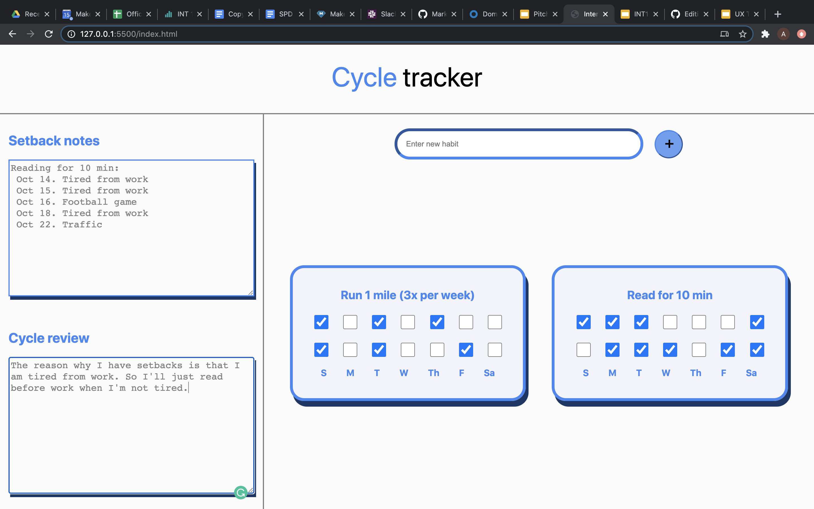

# CYCLE TRACKER

## PROJECT MOTIVATION:

More than ever before, interest in habit formation and habit tracking has surged. As people try to be more productive throughout the day and make commitments to themselves, they make and track habits of their choice. However, most people set over-ambitious goals. For example, workout every day. Often times, our habits and commitments overwhelm us and we simply give up; we don't set realistic expectations. 

This project is a habit tracker that uses the Martin Method. This method allows for more intentional, thoughtful, and reflective habit formation. Rather than relying on streeks to fuel motivation, the martin method allows users to reflect on their habits every 2 weeks and allows them to make appropriate adaptations. 

## SCREEN SHOT OF PROJECT
You can enter a new habit in the input and when you click the + button, a new habit tacker with that name will be created. If input is empty, nothing will heppen.

You can also check of what days you did or didn't do your habit.

If you fail to acomplish your goal, write out the date misses and reason why on the "setback notes."

After the end of the two weeks, reflect on setbacks and adjust habit.

Then you start a new two-week cycle with updated goals.

## HOW TO BUILD CODE

No Dependencies or installations needed

In the repo directory, run the following in your terminal:

open index.html
